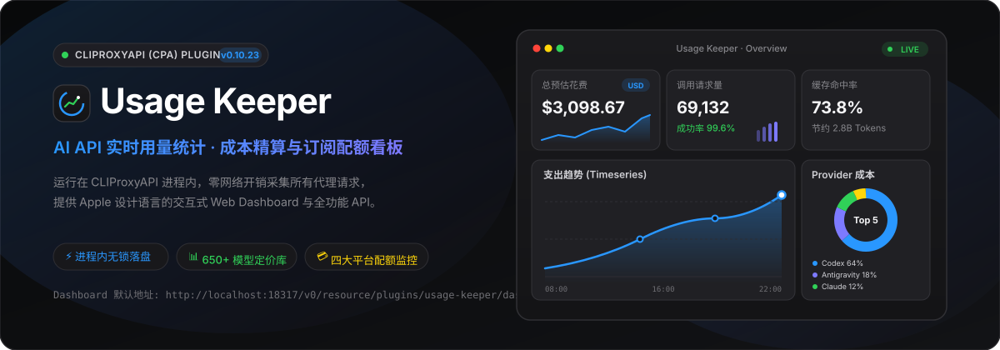
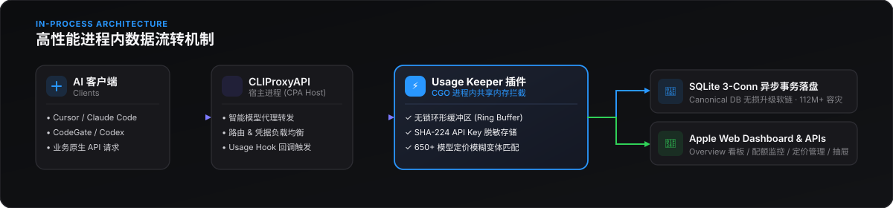

<p align="center">
  
</p>

<p align="center">
  <a href="https://github.com/rainoffallingstar/CPA-Usage-Keeper-Plugin/releases"></a>
  <a href="https://github.com/router-for-me/CLIProxyAPI"></a>
  <a href="https://golang.org"></a>
  <a href="https://sqlite.org"></a>
  <a href="#dashboard-功能矩阵"></a>
  <a href="./LICENSE"></a>
</p>

---

## 💡 什么是 Usage Keeper？

**Usage Keeper** 是一款运行在 [CLIProxyAPI (CPA)](https://github.com/router-for-me/CLIProxyAPI) 宿主进程内的高性能 AI API 用量监控、成本精算与订阅配额管理插件。

通过 CGO 进程内共享内存直接拦截所有流经代理的请求，实现**零额外网络开销**、**无锁内存环形缓冲**与**异步事务持久化**。前端采用纯正 **Apple 视觉设计语言**（Apple Design System），提供涵盖时间序列趋势、渠道成本占比、模型排行榜及四大提供商订阅配额的现代化交互看板。

---

## ⚡ 核心特性

<p align="center">
  
</p>

### 🍏 1. Apple 设计语言与真实数据可视化
- **Overview（概览首屏）**：一眼尽览总预估花费、调用请求量、Token 吞吐构成与缓存命中率，全部 KPI 卡片均搭载真实事件流生成的**自绘 SVG 迷你面积趋势图**。
- **时间序列趋势主图**：支持「支出成本 ($)」与「调用量」双模自由切换，自适应分桶（Hourly / Daily）并配备交互式数据浮窗。
- **Provider 成本分布环形图**：智能清洗复杂渠道名称，按 Top 5 +「其他渠道」智能聚合，配备 Apple 阶梯彩色色板。
- **高耗资模型 Top 5 排行榜**：按实际消耗金额由高至低排列，展示双色比例条与请求频次。

### 💳 2. 多平台订阅配额监控 (Quota)
- **OpenCode Go**：实时监控 5 小时滚动窗口、每周及每月用量，支持多工作区自动解析与免费/未订阅账号优雅识别。
- **智谱 GLM Coding**：追踪每日调用额度上限、剩余百分比、重置倒计时与模型使用拆分。
- **DeepSeek 官方账户**：实时查询预付费账户余额（USD）与使用率。
- **Ollama Cloud**：精准解析 `ollama.com` 会话限额（Session / 5h 窗口）与每周限额（Weekly），模型调用次数精准归属于各自窗口下方。

### 📊 3. 650+ 模型动态定价与智能匹配
- **云端自动同步**：每 6 小时自动从 [modelprice.boxtech.icu](https://modelprice.boxtech.icu) 拉取 650+ 主流大模型的官方最新定价（Prompt / Completion / Cache）。
- **变体后缀自动回退**：对带冒号版本（如 `deepseek-v4-pro:0813`）或变体后缀（如 `claude-opus-4-6-thinking`、`gemini-3-7-flash-high`、`deepseek-v4-pro:preview`）自动模糊回退匹配基础型号单价。
- **在线维护与编辑**：支持按提供商分类折叠管理，可在 Web 端直接通过模态弹窗修改或新增定价规则。

### ⚡ 4. 极致性能与零损耗持久化
- **进程内无锁拦截**：使用容量 10,000 的内存环形缓冲区（Ring Buffer）实现瞬时入队，代理转发请求延迟增加 `< 0.05ms`。
- **SQLite 异步批量事务**：双缓冲区自动定时批量落盘，配合 SQLite 3-conn 连接池，历经数十万次高并发请求零丢失。
- **版本升级无损软链**：配合迁移脚本自动将 SQLite 库重定向至版本无关的 Canonical 目录（`upstream/data/usage-keeper.db`），CPA 版本自动升级绝不丢失历史数据。

### 🔍 5. 交互式滑动抽屉 (Inspector Drawer)
- 请求流水日志支持按调用状态、客户端来源（Cursor、Claude Code、CodeGate、API）及关键词实时检索。
- 点击任意记录呼出右侧抽屉，查看 Token 拆分、执行耗时、脱敏凭据及完整 JSON 载荷。
- 完整保留 **Apple 物理弹簧拖拽手势（1:1 惯性跟随与速度释放判定）**。

---

## 🚀 快速上手

### 1. 编译构建
```bash
# 编译当前平台的动态链接库 (.dylib / .so / .dll)
make build
```

### 2. 部署到 CPA 插件目录
```bash
# 方式 A：使用内置的一键热重载迁移脚本（推荐）
./scripts/migrate-plugin.sh --apply --force-build

# 方式 B：手动部署并重载
cp dist/usage-keeper.dylib "你的CPA目录/plugins/darwin/arm64/usage-keeper-v0.10.23.dylib"
# 修改或 touch 配置文件触发 CPA 动态热重载
```

### 3. 打开 Web Dashboard
在浏览器中访问：
```text
http://<你的CPA地址:端口>/v0/resource/plugins/usage-keeper/dashboard
```

---

## 🖥️ Dashboard 功能矩阵

| 标签页 | 功能概述 | 核心能力 |
|---|---|---|
| **概览 (Overview)** | 全局核心指标与可视化大屏 | 总花费、调用量、Token 吞吐、缓存率、时间序列折线/面积图、Provider 成本环形图、Top 5 模型排行榜 |
| **模型明细 (By Model)** | 各大模型的用量消耗分析 | 「已聚合 (折叠变体)」与「详细列表」双模切换、输入/输出比例条、缓存命中徽章、单模型一键跳转过滤 |
| **请求日志 (All Events)** | 全量请求流水与排障抽屉 | 状态/来源客户端/关键词多维检索、失败错误展开、右侧滑动抽屉（含脱敏凭据与完整 JSON） |
| **订阅配额 (Quota)** | 四大提供商余额与用量监控 | OpenCode Go、智谱 GLM、DeepSeek 官方余额、Ollama Cloud（Session / Weekly 模型归属） |
| **定价管理 (Pricing)** | 模型计费规则维护与同步 | 云端 650+ 模型一键同步、提供商分类折叠、模糊变体回退匹配、弹出式编辑/新增/删除 Modal |
| **系统健康 (Health)** | 进程运行与底层存储健康度 | 内存环形缓冲区圆环仪表、SQLite 文件大小与写入耗时、API 响应缓存命中率、系统告警状态灯 |

---

## ⚙️ 配置文件说明 (`config.yaml`)

在 CLIProxyAPI 的 `config.yaml` 中添加 `usage-keeper` 配置块：

```yaml
plugins:
  enabled: true
  dir: ./plugins
  configs:
    usage-keeper:
      enabled: true
      priority: 1
      db_path: ./data/usage-keeper.db     # SQLite 数据库路径（相对路径将自动软链至 Canonical DB）
      retention_days: 90                  # 数据保留天数（默认 90 天）
      max_in_memory_events: 1000          # 内存环形缓冲区大小（最大 10000）
      refresh_seconds: 0                  # 仪表盘自动刷新间隔（秒，0 = 手动刷新）
      write_batch_size: 100               # 每次批量事务写入 SQLite 的最大事件数
      write_flush_seconds: 10             # 未满批次的最大内存停留秒数
      api_key_hash_salt: "my-secret-salt" # API Key 脱敏哈希盐值（可选）

      # 可选：预配置 OpenCode Go 账号（也可在 Dashboard 中直接添加）
      opencode_go_accounts:
        - name: "主工作区账号"
          auth_cookie: "auth=eyJhbGciOi..."
          workspace_id: "wrk_01..."

      # 可选：预配置智谱 GLM Coding 账号
      glm_coding_accounts:
        - name: "GLM 开发者"
          api_key: "sk-..."
          base_url: "https://open.bigmodel.cn"

      # 可选：预配置 DeepSeek 账号
      deepseek_accounts:
        - name: "DeepSeek 官方"
          api_key: "sk-..."

      # 可选：预配置 Ollama Cloud 账号
      ollama_accounts:
        - name: "Ollama Cloud 个人"
          session_cookie: "aid=...; __Secure-session=..."
          show_session: true
          show_weekly: true
```

---

## 📡 REST API 端点

所有资源端点均挂载在 `/v0/resource/plugins/usage-keeper` 下（无需单独认证，供 Dashboard 消费）：

| 路径 | 方法 | 说明 |
|---|---|---|
| `/dashboard` | `GET` | 现代化 Apple 风格 Web Dashboard HTML |
| `/api/summary` | `GET` | 聚合统计（请求数、Token 拆分、缓存命中率、均延，支持 `range=1h/6h/24h/7d/30d`） |
| `/api/models` | `GET` | 按模型聚合列表（请求数、Tokens、预估成本，支持 `provider` 过滤） |
| `/api/events` | `GET` | 分页请求事件日志（支持 `limit`、`offset`、`model`、`source`、`auth` 过滤） |
| `/api/health` | `GET` | 运行状态、环缓冲负载、SQLite 文件体积与写入延迟指标 |
| `/api/prices` | `GET` | 模型定价规则列表 |
| `/api/prices/sync` | `GET` | 触发从 modelprice.boxtech.icu 在线同步最新定价 |
| `/api/opencode-quota` | `GET/POST` | OpenCode Go 账号配额获取、添加与刷新 |
| `/api/glmcoding-quota`| `GET/POST` | 智谱 GLM Coding 账号配额获取与管理 |
| `/api/deepseek-quota` | `GET/POST` | DeepSeek 官方余额获取与管理 |
| `/api/ollama-quota`   | `GET/POST` | Ollama Cloud 会话与周度限额获取 |
| `/api/usage`          | `GET` | Quotio 格式兼容的聚合用量端点 |

---

## 🛠️ 跨平台构建矩阵

插件原生支持 5 大操作系统与架构组合：

```bash
# 交叉编译指定目标平台
GOOS=darwin  GOARCH=arm64 make build   # macOS Apple Silicon (.dylib)
GOOS=darwin  GOARCH=amd64 make build   # macOS Intel (.dylib)
GOOS=linux   GOARCH=amd64 make build   # Linux x86_64 (.so)
GOOS=linux   GOARCH=arm64 make build   # Linux aarch64 (.so)
GOOS=windows GOARCH=amd64 make build   # Windows x64 (.dll)
```

---

## 🔄 热更新部署与升级

每次发布新版本时，CPA 会根据动态库文件名中的版本号进行字典序比较并自动加载最高版本。

推荐通过自带脚本一键完成构建与热更新：
```bash
./scripts/migrate-plugin.sh --apply --force-build
```

该脚本将自动执行：
1. 读取 `types.go` 中的最新版本号并完成交叉编译。
2. 将构建出的动态库自动部署至活跃 CPA 版本的 `plugins/` 目录。
3. 校验并确保 SQLite 数据库无损软链接至版本无关的 Canonical 目录。
4. 切换 `config.yaml` 的刷新间隔，平滑触发宿主进程动态热重载。
5. 自动验证 `dashboard` 200 返回状态与占位符完整性。

---

## 📄 License

本项目基于 [MIT License](./LICENSE) 开源。

受 [cpa-usage-keeper](https://github.com/Willxup/cpa-usage-keeper) 启发并全面重构。
